# cg-course — лабораторные по компьютерной графике

C++17 · OpenGL 3.3 Core · GLFW 3.4 · GLAD · GLM 1.0.1 · CMake

## Структура

```
cg-course/
├── CMakeLists.txt        общий CMake: зависимости + подключение недель
├── external/glad/        загрузчик функций OpenGL 3.3 Core (сгенерирован glad2)
├── week01/               окно, цикл отрисовки, ввод, FPS
├── week02/               VAO/VBO, первые треугольники, сетка
├── week03/               атрибут цвета, интерполяция, ошибки шейдеров
│   └── shaders/          GLSL-файлы (читаются во время работы)
├── week05/               индексный буфер (EBO), glDrawElements
├── docs/results/         скриншоты и вывод консоли запусков
└── README.md
```

GLFW и GLM скачиваются автоматически при первой конфигурации CMake
(`FetchContent`), поэтому первый запуск `cmake` требует интернет.

## Сборка и запуск

### Windows — Visual Studio 2022

Нужен Visual Studio 2022 с компонентом **Desktop development with C++**
(в него входит **C++ CMake tools for Windows**).

Вариант 1 — из IDE: **File → Open → Folder** → папка `cg-course`,
вверху выбрать цель (`week01.exe` и т.д.) и нажать **F5**.

Вариант 2 — из терминала **x64 Native Tools Command Prompt for VS 2022**:

```
cmake -B build
cmake --build build --config Debug
build\bin\Debug\week01.exe
```

### Linux / macOS

```bash
# Linux: sudo apt install build-essential cmake libx11-dev libxrandr-dev \
#        libxinerama-dev libxcursor-dev libxi-dev libgl1-mesa-dev
cmake -B build -DCMAKE_BUILD_TYPE=Debug
cmake --build build
./build/bin/week01
```

Собрать только одну программу: `cmake --build build --target week01`.

| Неделя | Исполняемые файлы |
|---|---|
| 1 | `week01` |
| 2 | `week02_triangles`, `week02_grid` |
| 3 | `week03` |
| 5 | `week05` |

Если после правки `CMakeLists.txt` что-то странно ломается — удалите папку
`build` и сконфигурируйте заново.

---

## Неделя 1 — окно и главный цикл

**Задача.** Настроить окружение (CMake + GLFW + GLAD + GLM), открыть окно
1280×720 с контекстом OpenGL 3.3 Core, вывести в консоль версию OpenGL и
название видеокарты, сделать анимированный цвет фона, переключение фона
пробелом, выход по Esc и счётчик FPS.

**Что сделано** (`week01/main.cpp`):

- окно создаётся с запросом OpenGL 3.3 Core, функции OpenGL загружаются через GLAD;
- в консоль выводятся vendor, renderer, версия OpenGL и GLSL;
- фон плавно переливается: три синусоиды со сдвигом фазы 120° для R, G, B;
- клавиши обрабатываются через `glfwSetKeyCallback` — колбэк срабатывает один
  раз на нажатие, поэтому переключатели не «дребезжат»;
- FPS считается раз в секунду и выводится в консоль и в заголовок окна;
- при изменении размера окна обновляется `glViewport`.

| Клавиша | Действие |
|---|---|
| Space | анимированный фон ⇄ белый фон |
| V | включить/выключить VSync (видно, как меняется FPS) |
| Esc | выход |

**Результат** (AMD Radeon Graphics, OpenGL 3.3 Core):

| Анимированный фон | Space — белый фон |
|---|---|
| 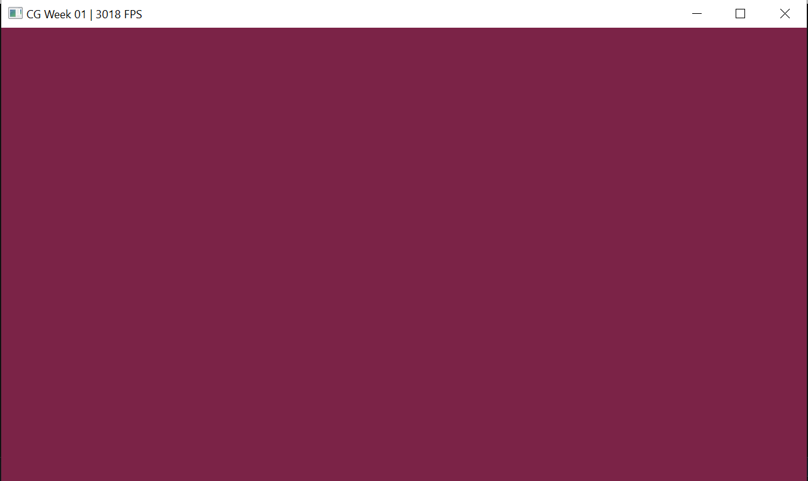 | 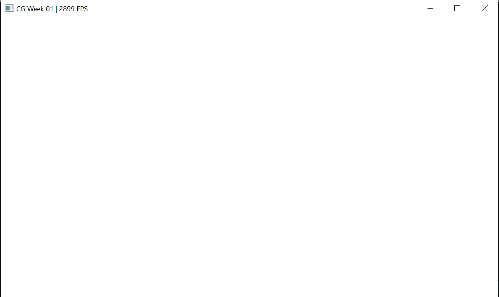 |

Без VSync ~2100–3000 FPS, с VSync — 165 FPS (частота монитора).
Полный вывод консоли: [week01_console.txt](docs/results/week01_console.txt).

---

## Неделя 2 — VAO, VBO и первые треугольники

**Задача.**
1. Нарисовать два треугольника из одного буфера вершин (координаты в NDC).
2. Переключать примитив `GL_TRIANGLES` ⇄ `GL_LINE_LOOP`.
3. Включать/выключать каркасный режим (`glPolygonMode`).
4. Раскрасить треугольники в разные цвета через uniform.
5. Отдельная программа: сетка 3 столбца × 4 строки, каждая клетка разрезана
   диагональю на два треугольника — нижний-правый белый, верхний-левый чёрный.

**Что сделано:**

- `week02/gl_helpers.*` — создание окна и сборка шейдерной программы
  (с проверкой ошибок компиляции и линковки), общие для обеих программ;
- `week02/triangles.cpp` — 6 вершин в одном VBO, два `glDrawArrays` по 3 вершины,
  перед каждым свой `uFillColor`; три палитры на выбор;
- `week02/grid.cpp` — вершины сетки генерируются в цикле. Буфер устроен так, что
  сначала идут все белые треугольники, потом все чёрные, — вся сетка
  рисуется **двумя** вызовами `glDrawArrays`. Вершины заданы в «клетках», а
  uniform `uCellToNdc` переводит их в NDC с учётом соотношения сторон окна, поэтому
  клетки остаются квадратными при любом размере окна.
  Размер сетки и цвета меняются константами `kCols`, `kRows`,
  `kLowerHalfColor`, `kUpperHalfColor` в начале файла.

`week02_triangles`:

| Клавиша | Действие |
|---|---|
| L | `GL_TRIANGLES` ⇄ `GL_LINE_LOOP` |
| W | каркасный режим вкл/выкл |
| C | следующая палитра |
| Esc | выход |

`week02_grid`:

| Клавиша | Действие |
|---|---|
| W | каркасный режим (видны диагонали клеток) |
| Esc | выход |

**Результат — треугольники:**

| `GL_TRIANGLES` | L — `GL_LINE_LOOP` |
|---|---|
| 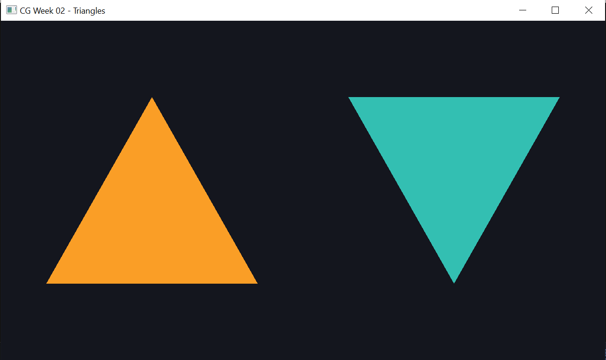 | 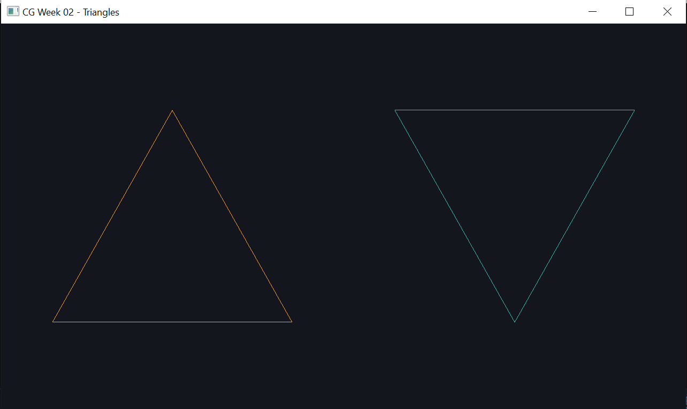 |
| **W — wireframe** | **C — другая палитра** |
|  | 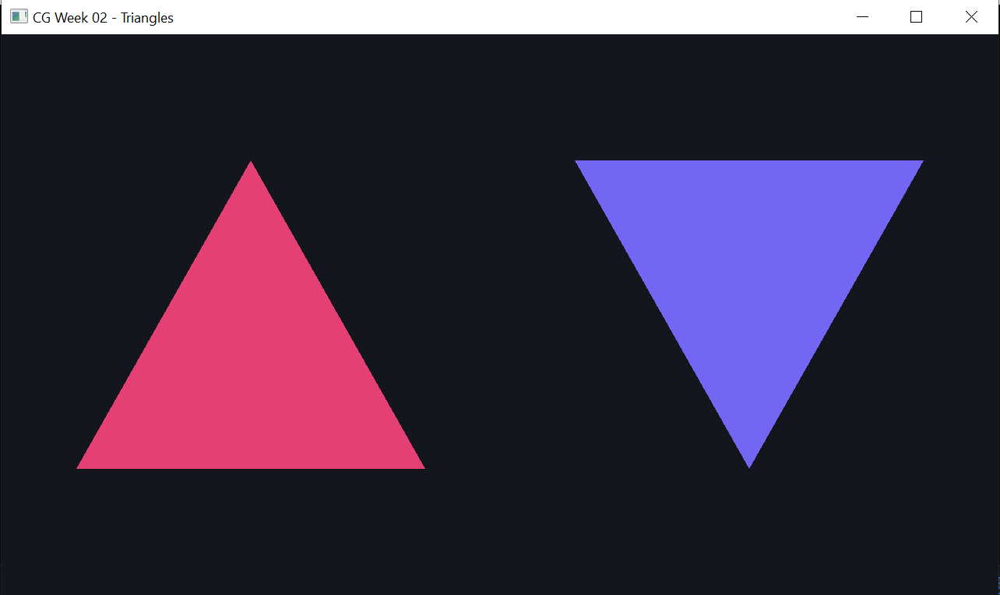 |

**Результат — сетка 3×4:**

| Обычный режим | W — wireframe | Узкое окно 500×800 |
|---|---|---|
| 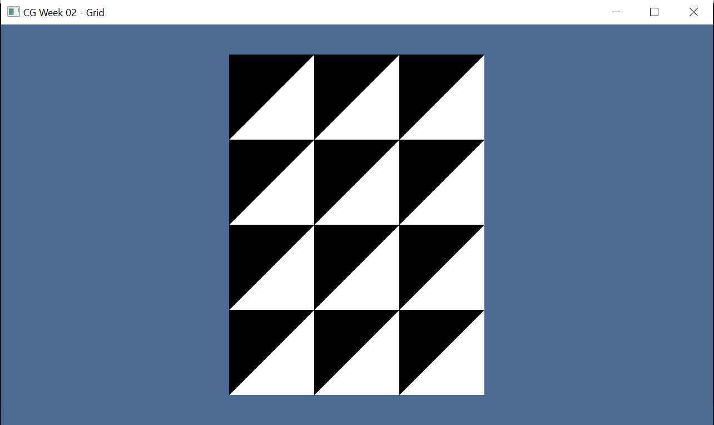 | 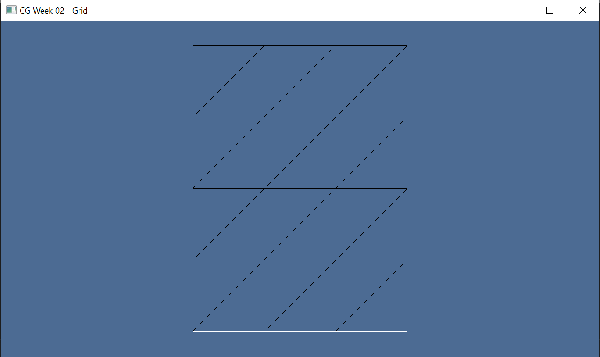 | 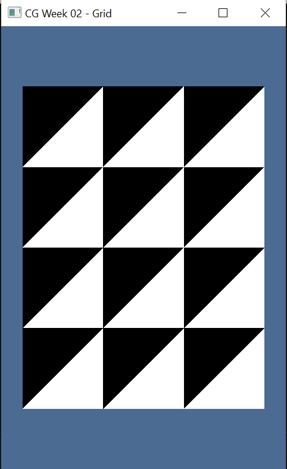 |

Вывод консоли: [треугольники](docs/results/week02_triangles_console.txt),
[сетка](docs/results/week02_grid_console.txt).

---

## Неделя 3 — шейдеры: атрибут цвета и интерполяция

**Задача.** Добавить вершинам второй атрибут — цвет — и передать его из
вершинного шейдера во фрагментный, чтобы увидеть интерполяцию по треугольнику.
1. Инвертировать цвет в фрагментном шейдере (`1.0 - цвет`) по клавише.
2. Дать всем трём вершинам одинаковый цвет и убедиться, что градиент пропадает.
3. Проверять ошибки компиляции и линковки шейдеров и выводить лог;
   специально сломать шейдер и посмотреть на сообщение об ошибке.

**Что сделано:**

- `week03/main.cpp` — вершина = `{позиция vec2, цвет vec3}` в одном буфере
  (interleaved); два атрибута описаны через `offsetof`. Клавиша U переписывает
  цвета прямо в существующем VBO через `glBufferSubData`;
- `week03/shader_program.*` — класс `ShaderProgram`: читает GLSL из файлов,
  проверяет `GL_COMPILE_STATUS` / `GL_LINK_STATUS`, печатает лог нужной длины
  (`GL_INFO_LOG_LENGTH`) с именем файла. Если новый шейдер не собрался,
  остаётся прежний рабочий — программа не падает;
- `week03/shaders/` — `triangle.vert`, `triangle.frag` и намеренно сломанный
  `broken.frag`. Путь к папке подставляет CMake, поэтому шейдеры можно править
  при запущенной программе и нажимать R — пересобирать проект не нужно.

| Клавиша | Действие |
|---|---|
| I | инверсия цвета в фрагментном шейдере |
| U | один цвет на всех вершинах ⇄ красный/зелёный/синий |
| R | перечитать шейдеры с диска |
| B | загрузить `broken.frag` → в консоли лог ошибки с номером строки |
| Esc | выход |

**Результат:**

| Интерполяция цвета | I — инверсия |
|---|---|
|  | 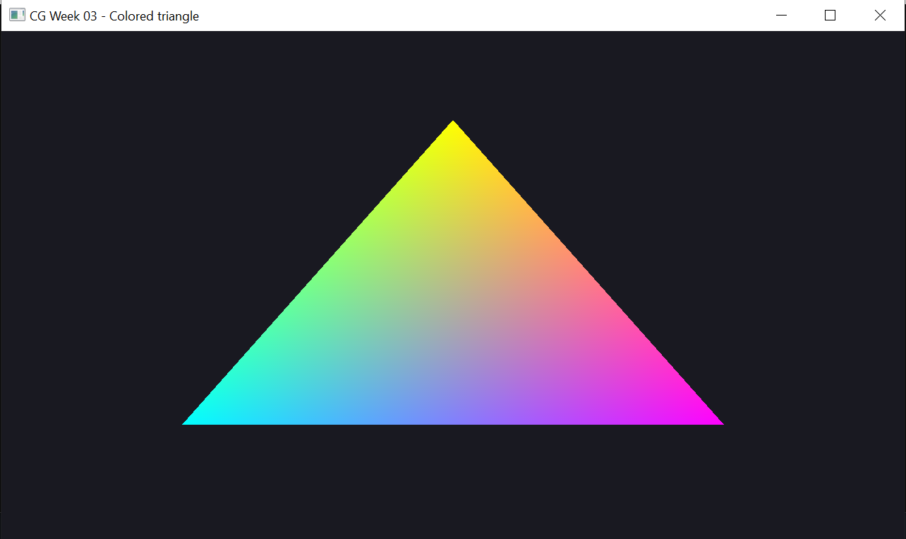 |
| **U — один цвет на всех вершинах** | **После B: сломанный шейдер не загрузился, работает прежний** |
| 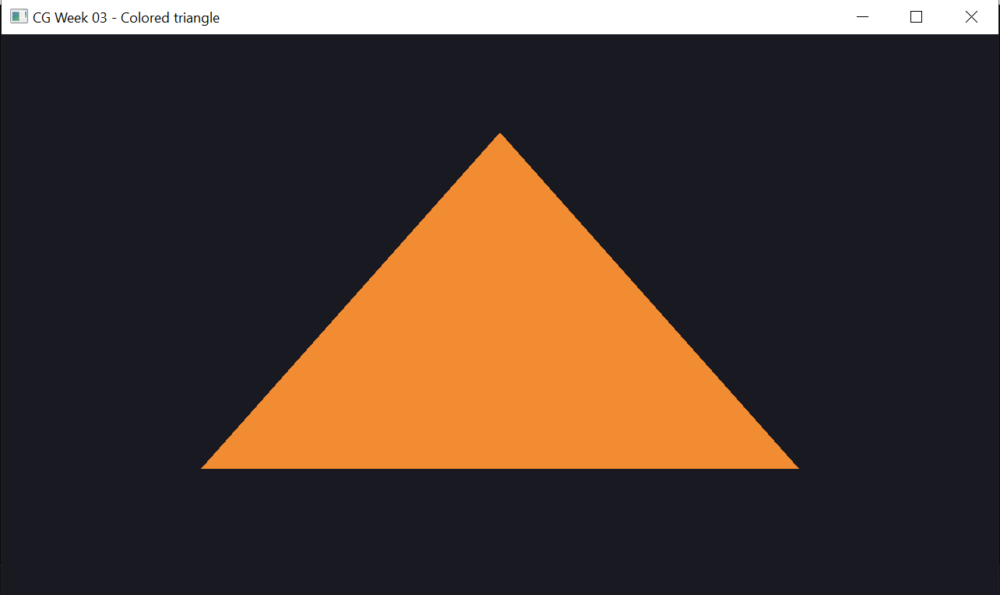 | 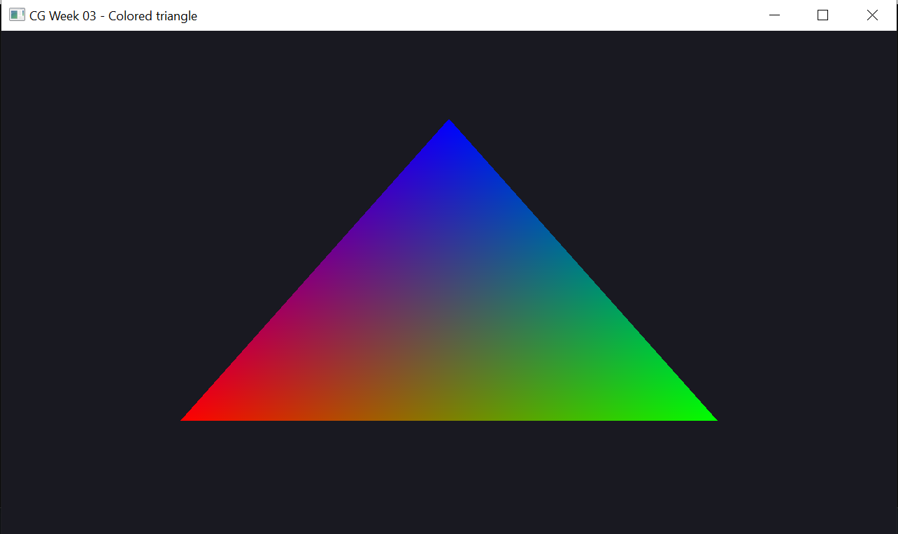 |

Вывод в консоль по клавише B
(полностью — [week03_console.txt](docs/results/week03_console.txt)):

```
[compile error] <repo>/week03/shaders/broken.frag
Fragment shader failed to compile with the following errors:
ERROR: 0:13: error(#143) Undeclared identifier: vertexColour
ERROR: error(#273) 1 compilation errors.  No code generated
Keeping the previous working shader
```

`0:13` — ошибка в строке 13 файла `broken.frag`.

---

## Неделя 5 — индексный буфер (EBO)

**Задача.** Нарисовать четырёхугольник из 4 вершин и 6 индексов через
`glDrawElements`, двигать его по окружности (с учётом `dt`).
1. Заменить индексы на `{0, 1, 2}` и рисовать 3 индекса — остаётся один треугольник.
2. Пятиугольник: 5 вершин, 3 треугольника, 9 индексов.
3. Два четырёхугольника из одного VAO: две пары «uniform + draw».
4. Дополнительно: оба четырёхугольника движутся по кругу навстречу друг другу.

Переключение примитива (`GL_TRIANGLES`, `GL_LINE_LOOP`, `GL_LINE_STRIP`,
`GL_POINTS`) и каркасного режима.

**Что сделано:**

- `week05/indexed_mesh.*` — `IndexedMesh` (VAO + VBO + EBO + число индексов).
  `createIndexView` создаёт новый VAO и EBO поверх **того же** VBO: для задачи 1
  вершины не копируются, меняются только индексы;
- пятиугольник строится функцией `buildRegularPolygon` для любого числа сторон:
  вершины на окружности, триангуляция «веером» из вершины 0 —
  `(0,1,2), (0,2,3), (0,3,4)`;
- движение: `угол += скорость * dt`, сдвиг передаётся в шейдер uniform-ом `uShift`;
- uniform `uAspectFix` (высота/ширина) сжимает x, чтобы квадрат оставался
  квадратом, а окружность — окружностью в широком окне;
- `ShaderProgram` — тот же класс, что в неделе 3, шейдеры в `week05/shaders/`.

| Клавиша | Действие |
|---|---|
| 1 | квадрат (4 вершины, 6 индексов), движется по кругу |
| 2 | индексы `{0,1,2}`, 3 индекса — один треугольник |
| 3 | пятиугольник (5 вершин, 9 индексов) |
| 4 | два квадрата из одного VAO |
| 5 | два квадрата движутся навстречу друг другу |
| P | следующий примитив: TRIANGLES → LINE_LOOP → LINE_STRIP → POINTS |
| Tab | каркасный режим |
| Esc | выход |

**Результат:**

| 1 — квадрат | 2 — индексы {0,1,2} | 3 — пятиугольник |
|---|---|---|
| 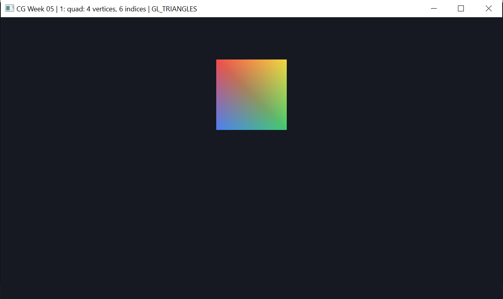 | 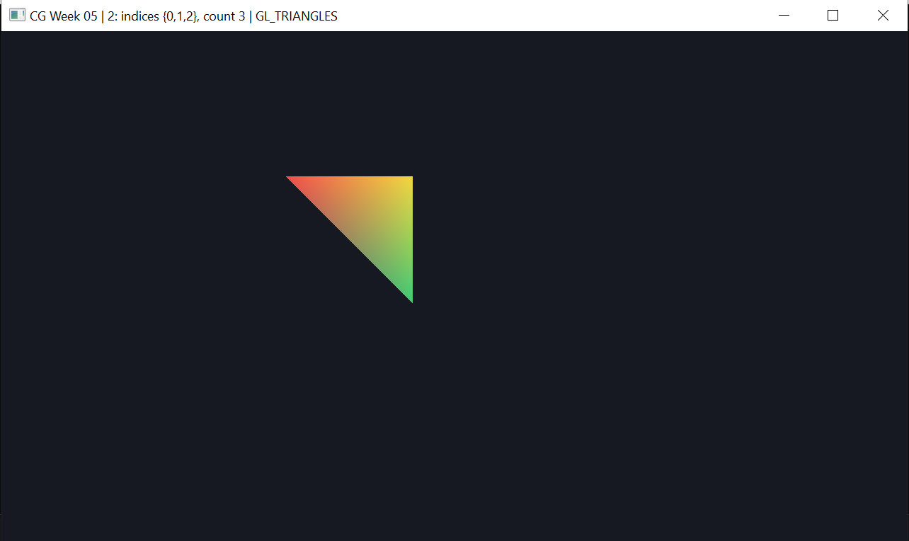 | 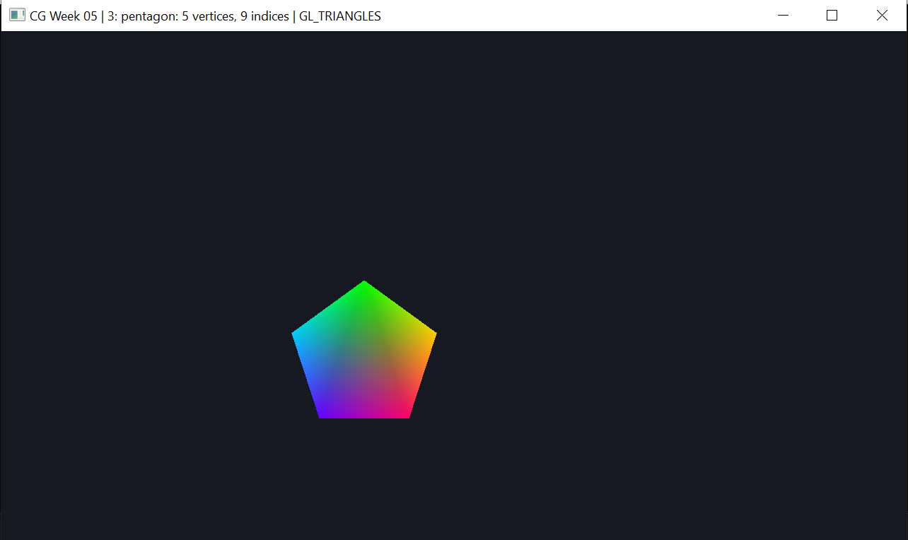 |
| **3 + Tab — видно 3 треугольника** | **4 — два квадрата** | **5 — навстречу друг другу** |
| 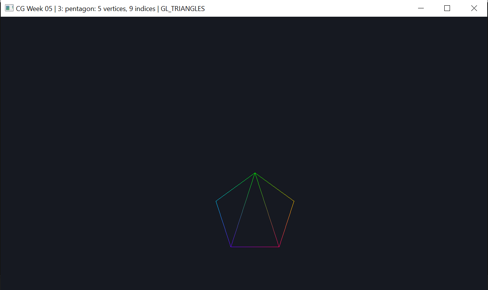 | 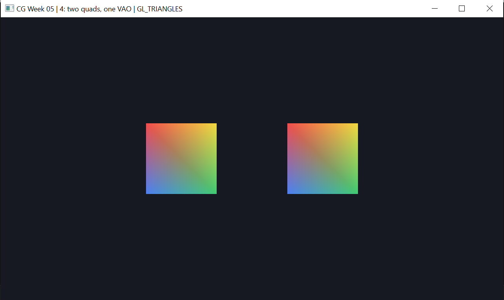 | 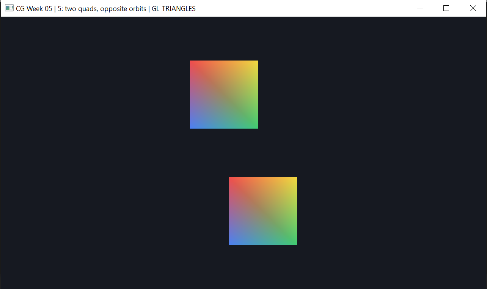 |
| **P — `GL_LINE_LOOP`** | **P — `GL_LINE_STRIP`** | **P — `GL_POINTS`** |
| 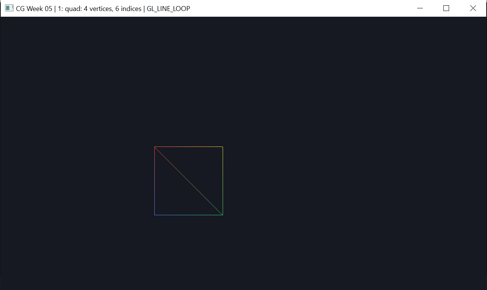 | 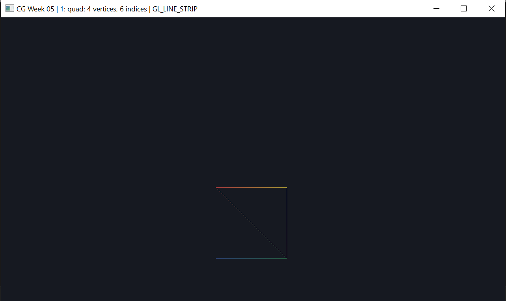 | 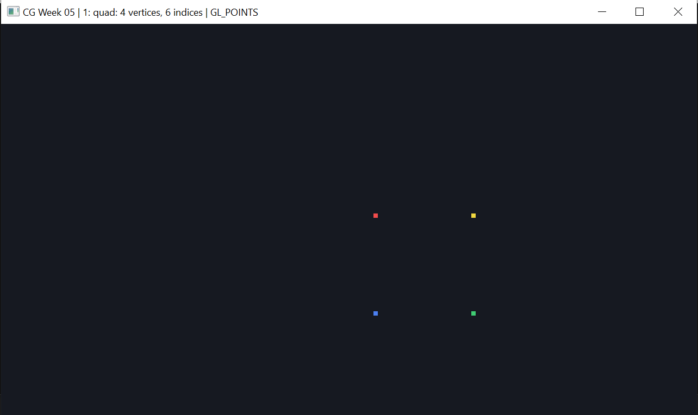 |

Вывод консоли: [week05_console.txt](docs/results/week05_console.txt).
